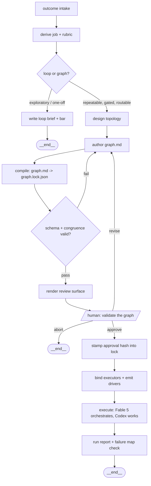

# Graph Engineering v2 — outcome-first, visually validated, multi-model

**Date:** 2026-07-25 · **Status:** strategy (research-backed, pre-implementation)
**Research basis:** full repo audit + three web-research sweeps (orchestration
frameworks, Codex CLI / GPT-5.6 lineup, visual graph tooling), all dated
July 25, 2026. Verification flags carried through from primary sources.

---

## 1. Where the field landed (and where this repo already stands)

Three findings frame everything below.

**The repo's doctrine won the industry argument.** By mid-2026 every major
framework converged on exactly the shape this skill teaches: a deterministic
backbone of typed edges and checkpoints with LLM intelligence inside nodes —
LangGraph 1.2.x, Microsoft Agent Framework 1.0 (GA April 2026, typed edges +
built-in checkpointing), CrewAI Flows wrapping crews in deterministic shells.
Free-form agent-to-agent chatter (old AutoGen) lost. The headline 1.0 feature
everywhere was **durable checkpointed execution** — which this skill already
encodes as state-on-disk, one file per key. The 12-Factor Agents manifesto
(Factors 5, 6, 7, 8, 12) is the citable articulation of the same doctrine.

**Visual canvases as source of truth died; compiled, reviewable artifacts won.**
OpenAI's Agent Builder — the flagship drag-and-drop agent canvas — is being
shut down November 30, 2026, ~13 months after launch, with "export as code"
as the migration path. Meanwhile GitHub Agentic Workflows (public preview
June 2026) went the other way: markdown + frontmatter **compiled** to a
locked, schema-validated artifact that a human reviews before it can ever
run. Practitioner consensus for diagram tooling matches: canonical
structured data validated by a schema, with Mermaid rendered as a
**deterministic projection** — the LLM never hand-writes the diagram.

**"Graph engineering" is an open term.** The ecosystem says "agent
orchestration," "durable execution," "agentic workflows." Nobody owns
"graph engineering." This repo can.

## 2. Challenged assumptions

| Initial thought | Challenge from research | Revised position |
|---|---|---|
| Keep hand-written `graph.md` (tables + hand-written Mermaid) as-is and bolt features on | Hand-written tables + hand-written Mermaid is exactly the dual-artifact drift the field abandoned; the current validator can't even check diagram/table congruence | `graph.md` stays the *authored* layer, but it is **compiled** to a schema-validated lock file, and the Mermaid inside it is **regenerated from the tables**, never hand-written |
| Add an interactive visual editor for the validation step | Agent Builder's death is a 13-month natural experiment: canvas-as-truth loses; one-way Mermaid→Excalidraw/tldraw converters fork truth | The visual is a **rendered review surface** (HTML artifact / GitHub-rendered Mermaid), edits flow back through `graph.md`, never through the picture |
| Outcome-first intake replaces the loop-or-graph gate | An outcome statement is often exploratory work — classic loop territory; killing the gate would break the skill's most honest feature | Outcome intake becomes a **derivation phase in front of** the gate: outcome → candidate repeatable job(s) + rubric → *then* loop-or-graph decides |
| Hardcode `gpt-5.6-sol` per node | Per-node model binding is table stakes, but research + gateway practice favor tier abstraction; model names churn (gpt-5.1→5.6 in 8 months) | Nodes declare an **executor + tier** (`codex:frontier`), a small runtime table resolves tiers to current model IDs in one place |
| Codex multi-agent means driving everything through one Codex session | Codex sub-agents v2 is real (stabilized in 0.145.0) but sub-agent model metadata is partially hidden under Sol by default, and cross-harness gates need to live in *our* driver, not inside either harness | Gates stay in the generated driver (shell/Workflow script); Codex sub-agents are used *inside* a node when a node itself fans out, not for inter-node routing |

## 3. Verified 2026 facts the design depends on

**Codex CLI (rust-v0.145.0, July 21, 2026):**
- `codex exec "<prompt>"` non-interactive; `--json` (JSONL event stream),
  `-o/--output-last-message <path>`, and — critical for gates —
  `--output-schema <schema.json>` which **forces the final message to
  conform to a JSON Schema**. `--full-auto` is deprecated; use
  `--sandbox read-only|workspace-write|danger-full-access`.
- `codex exec resume <SESSION_ID>` / `resume --last` continues a session
  non-interactively (sessions are JSONL under `~/.codex/sessions/`);
  `resume` also accepts `--output-schema`.
- Native sub-agents (multi-agent v2, stabilized 0.145.0): `[agents]`
  config (`max_concurrent_threads_per_session`, `default_subagent_model`,
  `default_subagent_reasoning_effort`), custom roles as TOML in
  `.codex/agents/` (`name`, `description`, `developer_instructions`,
  `model`, `model_reasoning_effort`, `sandbox_mode`).
- `codex mcp-server` exposes Codex as an MCP tool (mountable in Claude
  Code); `/import` migrates settings *from* Claude Code.
- Skills: SKILL.md standard, loaded from `.agents/skills` (project) and
  `~/.agents/skills` (user) — this repo's install layout is already correct.
- Reasoning effort: `minimal|low|medium|high|xhigh` verified; a Sol-only
  top tier exists but the config spelling (`max` vs `ultra`) is
  inconsistently documented — **do not depend on it**.

**GPT-5.6 lineup (GA July 9, 2026):** three tiers Luna → Terra → Sol.
`gpt-5.6-sol` is the flagship coding model: 1.05M context / 128K output,
$5 in / $0.50 cached / $30 out per 1M. **Caveat:** past 272K input tokens
billing jumps to 2× input / 1.5× output (Codex 0.144.6 pins its catalog to
272K for this reason) — node briefs should keep Codex inputs under 272K.
Sol-as-default is high-confidence but not verbatim-official; pass `-m`
explicitly in drivers.

**Claude Code (Fable 5 side):** Dynamic Workflows (May 2026) runs
deterministic orchestration scripts — `agent()` calls with JSON `schema`
enforcement, phases, 16-concurrent fan-out, worktree isolation. Artifacts
(June–July 2026) publish self-contained HTML pages from a CLI session —
the cleanest human-review surface available. `/loop` and `/schedule`
carry the cadence.

**Doctrine import from LangGraph:** on resume after an interrupt, nodes
re-execute from the top — therefore **side effects belong after gates**,
and any pre-gate work must be idempotent. Adopt as topology rule 9.

## 4. Target architecture — the Graph Engineering pipeline

The skill itself becomes a graph, with the user's validation as its one
human node. Outcome in, validated multi-model execution out:



### 4.1 Layered artifacts (one graph directory)

```
docs/graphs/<date>-<slug>/
├── graph.md            # AUTHORED: Job, State, Nodes, Routes, Gates,
│                       #   Failure map, Runtime — tables are the source
├── graph.lock.json     # COMPILED: schema-validated machine form +
│                       #   content hash + approval stamp (gh-aw pattern)
├── review.html         # RENDERED: self-contained review page
├── nodes/NN-<node>.md  # AUTHORED: one brief per node (unchanged)
├── drivers/
│   ├── workflow.md     # GENERATED: Claude Code Workflow script
│   └── run-codex.sh    # GENERATED: chained codex exec driver
└── state/<key>.json    # RUNTIME: one file per key, single writer
```

Rules of the layer cake:
1. Humans and the drafting agent edit **only** `graph.md` and `nodes/`.
2. The compiler regenerates everything else, including the Mermaid block
   *inside* `graph.md` (from the Nodes + Gates tables). Hand-editing the
   diagram becomes impossible drift by construction.
3. Drivers refuse to run unless `graph.lock.json`'s content hash matches
   the current `graph.md` **and** carries an approval stamp. Edit after
   approval → hash mismatch → re-validation required. This is the
   compile-and-lock gate GitHub Agentic Workflows proved out.

### 4.2 Schema additions to graph.md

One new column on the Nodes table and one new section:

```markdown
## Nodes
| # | node | responsibility | output key | runs | executor |
|---|---|---|---|---|---|
| 1 | audit    | rank + competitor audit | audit  | once | fable:frontier |
| 2 | implement| apply the fix plan      | diff   | once | codex:frontier |
| 3 | score    | score vs rubric         | review | once | fable:balanced |

## Executors
| tier | fable (Claude Code) | codex (Codex CLI) |
|---|---|---|
| frontier | claude-fable-5 | gpt-5.6-sol |
| balanced | claude-sonnet-5 | gpt-5.6-terra |
| fast | claude-haiku-4-5 | gpt-5.6-luna |
```

`executor` values: `fable:<tier>`, `codex:<tier>`, `human`. The Executors
table is the only place model IDs live — when GPT-5.7 ships, one table
row changes and every graph re-compiles.

Default assignment policy (the multi-model division of labor):
- **Fable 5 (orchestrator + judgment):** outcome derivation, research,
  topology design, creative/synthesis nodes, reviewer/scoring nodes,
  run-report. Reviewers stay on the orchestrator side so the model
  grading the work is not the model that did it — cross-vendor review
  is a genuine independence gain, not just cost routing.
- **Codex `gpt-5.6-sol` (implementation workhorse):** code-heavy nodes —
  repo edits, refactors, test writing, mechanical migrations. Sol is
  priced and pitched exactly for this; keep node inputs < 272K tokens.
- **Terra/Luna:** bulk mechanical sub-tasks inside a node (Codex
  sub-agents), formatting, extraction.
- **Human:** consequential choices only (rule 6 unchanged).

### 4.3 The visual validation gate (the new human node)

The compiler renders `review.html` — a single self-contained page:
color-coded Mermaid (steps / gates / human nodes / terminal via
`classDef`), the Nodes + Gates + Executors tables, the failure map, and
an explicit checklist ("every rejection routes to a fix node," "every
cycle bounded," "these 2 nodes edit the repo — sequential," "estimated
cost per run at these bindings"). Delivery, best-first:
1. **Claude Code Artifact** — publish `review.html`, hand the user a URL.
2. **Local browser** — `open review.html` (or claude-mermaid live-reload
   during iteration).
3. **GitHub PR** — the regenerated Mermaid in `graph.md` renders natively
   in the PR; approval = PR review. This is the team-workflow path.

Approval writes `{approved_by, date, graph_hash}` into
`graph.lock.json`. "Revise" loops to the authoring step with the user's
notes; "abort" ends the run — mirroring the skill's own rule 6 abort
semantics.

### 4.4 Cross-harness execution contract

State handoff is already file-based; formalize the per-node contract so
either harness (or a human) can run any node:

- **Input:** the node's brief path + the state file paths it Reads.
- **Output:** the driver — not the node — writes the node's final JSON
  to `state/<key>.json`. The node just emits it.
- **Codex node invocation (generated into `run-codex.sh`):**

```bash
codex exec \
  -m gpt-5.6-sol \
  --sandbox workspace-write \            # read-only for pure-analysis nodes
  --output-schema schemas/<node>.json \  # from the brief's Writes shape
  -o /tmp/<node>.last.json \
  "$(cat nodes/03-implement.md) — state inputs: state/audit.json"
jq -e '.done == true' /tmp/<node>.last.json && cp /tmp/<node>.last.json state/diff.json
```

- **Gates in the Codex driver:** plain `jq` on the verdict —
  `jq -r '.approved' state/review.json` — branch, count steps against
  `max_steps`. `--output-schema` makes rule 4 ("gates route on JSON,
  never a vibe") *mechanically enforced* on the Codex side.
- **Multi-turn nodes:** capture the session id from `codex exec --json`,
  use `codex exec resume <id>` for a fix node that must continue the
  implementer's context (same-session repair beats cold restart).
- **Claude driver:** the Workflow script maps 1:1 — `agent()` per node
  with `schema` from the brief, gates as `if`, review→fix as a bounded
  `while`; Codex-executed nodes become Bash steps calling the block
  above. Repo-editing nodes sequential or worktree-isolated (rule 3).
- **Codex sub-agents (within-node fan-out only):** a node brief may
  declare an internal fan-out ("one sub-agent per file"); the generated
  `.codex/agents/<role>.toml` pins role, model tier, and sandbox. Inter-
  node routing never happens inside Codex — the driver owns the routes.
- **Shared context:** emit/refresh `AGENTS.md` in the graph directory
  (state contract + refusals digest); Claude side reads it via
  `@AGENTS.md`. One instruction file, both harnesses.

### 4.5 Validator v2

Keep the shell validator's checks; add compiler-level checks:
1. `graph.lock.json` validates against the published JSON Schema.
2. **Congruence:** Mermaid edges ≡ Routes ≡ Gates targets (now free,
   since the diagram is generated).
3. Every `executor` value resolves against the Executors table.
4. Every reviewer node has a derivable JSON schema in its brief.
5. Side-effect nodes (publish, spend, delete) sit **after** their gate;
   flag any pre-gate side effect (idempotency rule).
6. Approval-stamp/hash freshness at driver start.

## 5. New doctrine (additions to the eight rules)

- **Rule 9 — side effects after gates.** A node that publishes, spends,
  or deletes runs only downstream of the gate that authorizes it;
  anything before a gate must be safe to re-execute. (LangGraph interrupt
  semantics; Temporal replay.)
- **Rule 10 — the graph itself passes a gate.** No driver runs an
  unapproved or drifted map. Plan gates (approve the artifact) and node
  gates (route on verdicts) are different species; a graph needs exactly
  one of the former and however many of the latter the failure history
  demands.
- **Terminology alignment:** keep "gates," adopt "durable execution" and
  "typed edges" in docs; cite 12-Factor Agents factor numbers. Claim
  "graph engineering" as the practice name — the term is unowned.

## 6. Roadmap

| Phase | Ships | Depends on |
|---|---|---|
| **P1 — Compile & lock** | JSON Schema for the graph; compiler (`graph.md` → `graph.lock.json`, regenerated Mermaid); validator v2 | nothing — pure repo work |
| **P2 — Visual gate** | `review.html` renderer; Artifact/local/PR delivery; approval stamping; revise/abort loop in SKILL.md | P1 |
| **P3 — Multi-model drivers** | `executor` column + Executors table; `run-codex.sh` + Workflow generators; per-node `--output-schema` emission; `.codex/agents/` role emission; AGENTS.md handoff | P1 |
| **P4 — Outcome-first intake** | Outcome→job derivation step (Fable 5 research phase, rubric drafting) in front of the loop-or-graph gate | none (doc change), but lands best after P2 so derived graphs hit the visual gate |

Sequencing note: P1 is the keystone — the lock file is what makes the
visual gate stampable (P2) and the drivers generatable (P3). P4 is
prose, not plumbing, and must not weaken the loop-or-graph gate.

## 7. Open questions / watch list

1. **Sol's top reasoning tier** — config spelling (`max` vs `ultra`)
   contradicts across official pages; pin drivers to `high`/`xhigh`
   until settled.
2. **Sol as Codex default** — high confidence, not verbatim-official;
   drivers always pass `-m` explicitly.
3. **272K billing knee** — monitor; may argue for Terra on long-context
   implementation nodes.
4. **Oracle Agent Spec** — track as a possible export target for the
   lock file; don't depend on it.
5. **Codex sub-agent metadata hiding under Sol**
   (`hide_spawn_agent_metadata` default) — verify per-role model pinning
   still holds in each Codex release before relying on Terra/Luna
   within-node fan-out.
