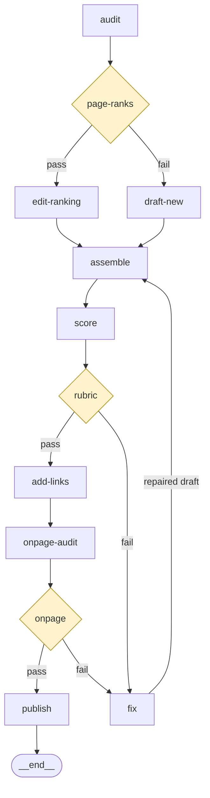

# Weekly SEO article — agent graph

## Job

One published, indexed article per week for a target keyword. The
draft must clear `docs/rubrics/seo-article.md` (structure, search
intent, internal links, on-page checks) before the CMS ever sees it.

## State

| key | type | written by | read by |
|---|---|---|---|
| audit | json | audit | draft-new, edit-ranking |
| draft | markdown | draft-new / edit-ranking / fix — exclusive, one writer per pass | assemble |
| article | markdown | assemble | score, add-links |
| final_article | markdown | add-links | onpage-audit, publish |
| review | json | score | fix, add-links |
| onpage | json | onpage-audit | fix |
| published_url | json | publish | — |

## Nodes

| # | node | responsibility | output key | runs | executor |
|---|---|---|---|---|---|
| 1 | audit | rank + competitor audit for the keyword | audit | once | fable:frontier |
| 2 | draft-new | draft a new article from the audit | draft | loop (cap 3) | fable:frontier |
| 3 | edit-ranking | edit the already-ranking page from the audit | draft | loop (cap 3) | fable:frontier |
| 4 | assemble | assemble + on-page optimize the current draft | article | once | codex:balanced |
| 5 | score | score the article against the rubric | review | once | fable:balanced |
| 6 | fix | repair the draft to exactly the issues the last verdict named | draft | once | codex:frontier |
| 7 | add-links | add internal links | final_article | once | codex:fast |
| 8 | onpage-audit | run the on-page audit checklist | onpage | once | fable:balanced |
| 9 | publish | publish to the CMS | published_url | once | codex:frontier |

## Executors

| tier | fable (Claude Code) | codex (Codex CLI) |
|---|---|---|
| frontier | claude-fable-5 | gpt-5.6-sol |
| balanced | claude-sonnet-5 | gpt-5.6-terra |
| fast | claude-haiku-4-5 | gpt-5.6-luna |

## Routes

Plain edges only — gate edges come from the Gates table; the diagram
below is generated by the compiler from both.

| from | to | label |
|---|---|---|
| draft-new | assemble | |
| edit-ranking | assemble | |
| assemble | score | |
| add-links | onpage-audit | |
| fix | assemble | repaired draft |
| publish | __end__ | |

## Gates

| gate | after | check | pass → | fail → |
|---|---|---|---|---|
| page-ranks | audit | audit.ranking_url != null | edit-ranking | draft-new |
| rubric | score | review.approved == true | add-links | fix |
| onpage | onpage-audit | onpage.approved == true | publish | fix |

## Failure map

| failure class | surfaces at | what you'll see |
|---|---|---|
| thin keyword, no angle | audit | audit.competitor_gap empty |
| draft off search intent | score | review.issues names intent |
| broken internal links | onpage-audit | onpage.issues lists 404s |
| CMS rejection | publish | publish error, article intact |

## Runtime

Mixed multi-model run: fable nodes (audit, drafting, scoring) run as
Claude Code subagents via drivers/workflow.md; codex nodes (assemble,
fix, add-links, publish) shell out to `codex exec` with the model
pinned per the Executors table. Reviewers stay on fable so the model
grading the work never wrote it. No node edits a repository, so no
worktree isolation needed. Publish is the only side-effect node and
sits after the onpage gate (rule 9). max_steps 14: the happy path is
9 steps and drafts historically clear in ≤3 rubric passes.
