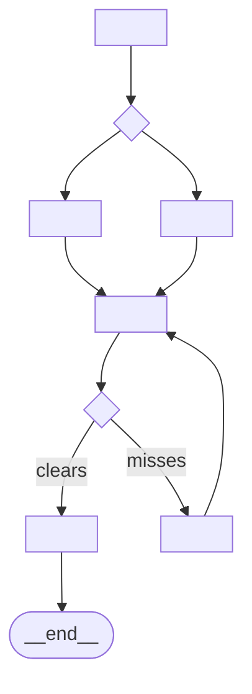
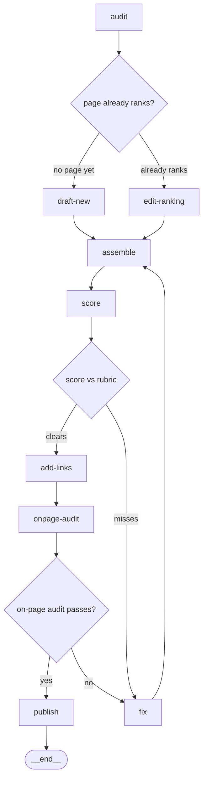

# graph.md template

The map file. Copy the skeleton, replace every `<...>`, delete
guidance comments. The validator
([../scripts/validate_graph.sh](../scripts/validate_graph.sh)) checks
this shape mechanically — keep the section names and table columns
exactly as written.

## Skeleton

````markdown
---
graph: <slug>
date: <YYYY-MM-DD>
owner: <who runs this>
cadence: <weekly | per-cohort | on-demand>
max_steps: <N>
version: "1.0"
---

# <Job name> — agent graph

## Job

<One paragraph: what one finished run produces, the cadence it
repeats on, and the bar the deliverable must clear. Name the rubric
file if one exists.>

## State

| key | type | written by | read by |
|---|---|---|---|
| <key> | <json / markdown / file path> | <node> | <nodes> |

## Nodes

| # | node | responsibility | output key | runs |
|---|---|---|---|---|
| 1 | <node-name> | <one clause, no "and"> | <key> | once |
| 2 | <node-name> | <one clause> | <key> | loop (cap 3) |
| 3 | <node-name> | <one clause> | <key> | human |

## Routes

<!-- The diagram IS the map. Every edge here is a route the work may
     take; draw no others. Gates appear as diamonds. -->



## Gates

| gate | after | check | pass → | fail → |
|---|---|---|---|---|
| <gate-name> | <node> | <JSON field & threshold, e.g. review.approved == true> | <node or __end__> | <corrective node> |

## Failure map

| failure class | surfaces at | what you'll see |
|---|---|---|
| <known failure> | <node> | <symptom in that node's output> |

## Runtime

<Which harness runs this and how (see run-the-graph.md). Worktree /
isolation notes for any repo-editing node. Restate max_steps and why
that number — e.g. "drafts historically clear in ≤3 review passes;
max_steps 12 bounds the whole run at roughly 2× the happy path.">
````

## Worked example — weekly SEO article

The pipeline from the loop-vs-graph essay: audit, branch on whether a
page already ranks, assemble, score against the rubric, fix until it
clears, publish.

````markdown
---
graph: seo-article
date: 2026-07-20
owner: content team
cadence: weekly
max_steps: 14
version: "1.0"
---

# Weekly SEO article — agent graph

## Job

One published, indexed article per week for a target keyword. The
draft must clear `docs/rubrics/seo-article.md` (structure, search
intent, internal links, on-page checks) before the CMS ever sees it.

## State

| key | type | written by | read by |
|---|---|---|---|
| audit | json | audit | route, draft-new, edit-ranking |
| draft | markdown | draft-new / edit-ranking / fix — exclusive, one writer per pass | assemble |
| article | markdown | assemble | score, add-links |
| final_article | markdown | add-links | onpage-audit, publish |
| review | json | score | fix, add-links |
| onpage | json | onpage-audit | fix |
| published_url | json | publish | — |

## Nodes

| # | node | responsibility | output key | runs |
|---|---|---|---|---|
| 1 | audit | rank + competitor audit for the keyword | audit | once |
| 2 | draft-new | draft a new article from the audit | draft | loop (cap 3) |
| 3 | edit-ranking | edit the already-ranking page from the audit | draft | loop (cap 3) |
| 4 | assemble | assemble + on-page optimize the current draft | article | once |
| 5 | score | score the article against the rubric | review | once |
| 6 | fix | repair the draft to exactly the issues the last verdict named | draft | once |
| 7 | add-links | add internal links | final_article | once |
| 8 | onpage-audit | run the on-page audit checklist | onpage | once |
| 9 | publish | publish to the CMS | published_url | once |

## Routes



## Gates

| gate | after | check | pass → | fail → |
|---|---|---|---|---|
| page-ranks | audit | audit.ranking_url != null | edit-ranking | draft-new |
| rubric | score | review.approved == true | add-links | fix |
| onpage | onpage-audit | onpage.approved == true | publish | fix |

## Failure map

| failure class | surfaces at | what you'll see |
|---|---|---|
| thin keyword, no angle | audit | audit.competitor_gap empty |
| draft off search intent | score | review.issues names intent |
| broken internal links | onpage-audit | onpage.issues lists 404s |
| CMS rejection | publish | publish error, article intact |

## Runtime

Claude Code Workflow, one agent per node; score and fix share the
rubric file. No node edits a repository, so no worktree isolation
needed. max_steps 14: the happy path is 9 steps and drafts
historically clear in ≤3 rubric passes.
````

Notes on the example worth copying:

- Three nodes write `draft`, but the routes make them **exclusive** —
  exactly one writes it per pass (the branch picks draft-new or
  edit-ranking; later passes only ever come through fix). When you do
  this, say "exclusive" in the State table's written-by cell, or the
  validator fails the duplicate.
- `page-ranks` is a branch, not a pass/fail check — it still gets a
  Gates row. Every diamond in the diagram gets a row.
- Both rejection routes converge on one corrective node (`fix`) that
  works from the last verdict's `issues`, then re-enters at
  `assemble` so the same gates re-check the repair.
- `fix` writes `draft`, not `article` — the repaired draft flows back
  through `assemble`, keeping `article` single-writer.

Mechanical notes (the validator parses tables with awk):

- No literal `|` inside a table cell — write alternatives with `/`
  as the skeleton does, or the columns shift.
- Gate pass/fail targets must match a Nodes-table node name exactly
  (backticks and spaces are stripped) or be `__end__`.
- Brief filenames are `nodes/NN-<node>.md` with exactly two digits,
  `<node>` matching the table name.
