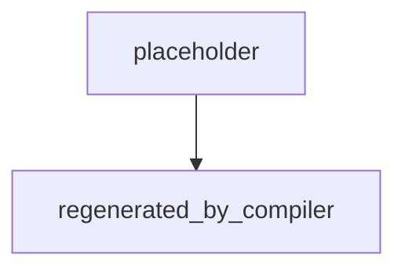

# graph.md template (v2)

The map file — the authored layer. Copy the skeleton, replace every
`<...>`, delete guidance comments. The compiler
([../scripts/compile_graph.py](../scripts/compile_graph.py)) parses
the tables mechanically — keep the section names and table columns
exactly as written — and **generates the mermaid diagram from them**;
never write or edit the diagram by hand.

## Skeleton

````markdown
---
graph: <slug>
date: <YYYY-MM-DD>
owner: <who runs this>
cadence: <weekly | per-cohort | on-demand>
max_steps: <N>
version: "2.0"
---

# <Job name> — agent graph

## Job

<One paragraph: what one finished run produces, the cadence it
repeats on, and the bar the deliverable must clear. Name the rubric
file if one exists.>

## State

| key | type | written by | read by |
|---|---|---|---|
| <key> | <json / markdown / file path> | <node> | <nodes, comma-separated> |

## Nodes

| # | node | responsibility | output key | runs | executor |
|---|---|---|---|---|---|
| 1 | <node-name> | <one clause, no "and"> | <key> | once | fable:frontier |
| 2 | <node-name> | <one clause> | <key> | loop (cap 3) | codex:frontier |
| 3 | <node-name> | <one clause> | <key> | human | human |

## Executors

<!-- The ONLY place model IDs live. Update here when models change;
     recompile and every binding follows. -->

| tier | fable (Claude Code) | codex (Codex CLI) |
|---|---|---|
| frontier | claude-fable-5 | gpt-5.6-sol |
| balanced | claude-sonnet-5 | gpt-5.6-terra |
| fast | claude-haiku-4-5 | gpt-5.6-luna |

## Routes

<!-- PLAIN edges only: linear steps, fan-out branches, joins, and any
     labeled abort edge from a human gate. Gate edges (node→gate,
     gate→pass, gate→fail) are derived from the Gates table — do not
     repeat them here. -->

| from | to | label |
|---|---|---|
| <node> | <node or __end__> | |



## Gates

| gate | after | check | pass → | fail → |
|---|---|---|---|---|
| <gate-name> | <node> | <state key.field & threshold, e.g. review.approved == true> | <node or __end__> | <corrective node> |

## Failure map

| failure class | surfaces at | what you'll see |
|---|---|---|
| <known failure> | <node> | <symptom in that node's output> |

## Runtime

<Which driver runs this (drivers/workflow.md for mixed multi-model,
drivers/run-codex.sh for cron/CI). Worktree / isolation notes for any
repo-editing node. Name the side-effect nodes and the gate that
authorizes each (rule 9). Restate max_steps and why that number.>
````

## Worked example — weekly SEO article, multi-model

The full worked example lives in the repo at
[`examples/seo-article/`](https://github.com/NicholasSpisak/graph/tree/main/examples/seo-article)
— authored `graph.md` + nine briefs, and every generated artifact
(lock, review page, both drivers) checked in so you can read what the
toolchain produces. The shape:

- **audit, draft-new, edit-ranking** on `fable:frontier` — research
  and creative work.
- **score, onpage-audit** (the reviewers) on `fable:balanced` —
  cross-vendor from the nodes they grade.
- **assemble, add-links** on `codex:balanced` / `codex:fast` —
  mechanical assembly.
- **fix, publish** on `codex:frontier` — precise repair, and the one
  side-effect node, placed after the onpage gate (rule 9).
- Routes table carries six plain edges; three gates carry the rest.

Notes worth copying:

- Three nodes write `draft`, but the routes make them **exclusive** —
  exactly one writes it per pass. Say "exclusive" in the State table's
  written-by cell, or the compiler fails the duplicate.
- `page-ranks` is a branch, not a pass/fail check — it still gets a
  Gates row. Every diamond in the diagram gets a row.
- Both rejection routes converge on one corrective node (`fix`) that
  re-enters at `assemble`, so the same gates re-check the repair.
- `fix` writes `draft`, not `article` — the repaired draft flows back
  through `assemble`, keeping `article` single-writer.

## Mechanical notes (the compiler parses the tables)

- No literal `|` inside a table cell — write alternatives with `/`.
- Gate `after`, `pass →`, and `fail →` must name a Nodes-table node
  exactly (backticks and spaces are stripped) or `__end__`.
- Gate checks are `<state key>.<jq expression>` — the compiler splits
  on the first dot and hands the rest to `jq` (shell driver) or
  translates it to a property test (Workflow driver).
- The Routes table must not repeat a gate-derived edge; the compiler
  flags duplicates.
- `runs` is `once`, `loop (cap N)`, or `human` — and `human` in
  `runs` requires `human` in `executor`, and vice versa.
- Brief filenames are `nodes/NN-<node>.md` with exactly two digits.
- Node #1 is the entry node.
